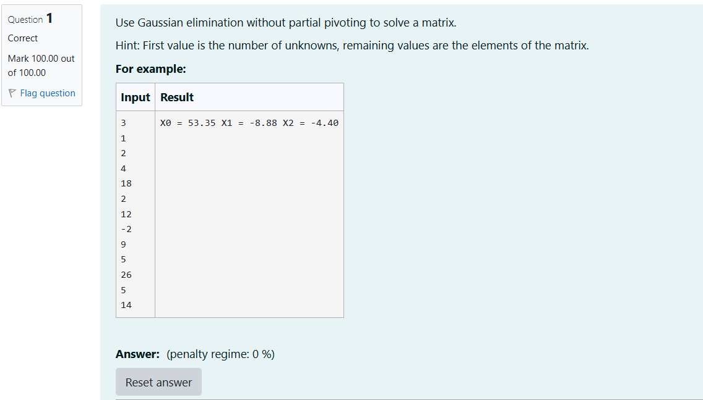

# Gaussian Elimination

## AIM:
To write a program to find the solution of a matrix using Gaussian Elimination.

## Equipments Required:
1. Hardware – PCs
2. Anaconda – Python 3.7 Installation / Moodle-Code Runner

## Algorithm
1. Start the program and import sys. Read the number of variables and the augmented matrix as input
2. Apply Gaussian elimination to convert the augmented matrix into an upper triangular matrix using row operations.
3. Perform back substitution to calculate the values of the unknown variables.
4. Display the solution of the variables.
## Program:
```
'''Program to solve a matrix using Gaussian elimination without partial pivoting.
Developed by: sriharikumar k
RegisterNumber: 212225230273
'''
import sys
n = int(input())
A=[[0]*(n+1) for _ in range(n)]
X=[0]*n
for i in range(n):
    for j in range(n+1):
        A[i][j] = float(input())
for i in range(n):
    if A[i][i] == 0.0:
        sys.exit('Divide by zero detected!')
    for j in range(i+1,n):
        r=A[j][i]/A[i][i]
        for k in range(n+1):
            A[j][k]-=r*A[i][k]
X[n-1]=A[n-1][n]/A[n-1][n-1]
for i in range(n-2, -1, -1):
    X[i]=A[i][n]
    for j in range(i+1,n):
        X[i]-=A[i][j]*X[j]
    X[i]=X[i]/A[i][i]
for i in range(n):
    print('X%d = %0.2f '%(i,X[i]),end='')
```

## Output:



## Result:
Thus the program to find the solution of a matrix using Gaussian Elimination is written and verified using python programming.

